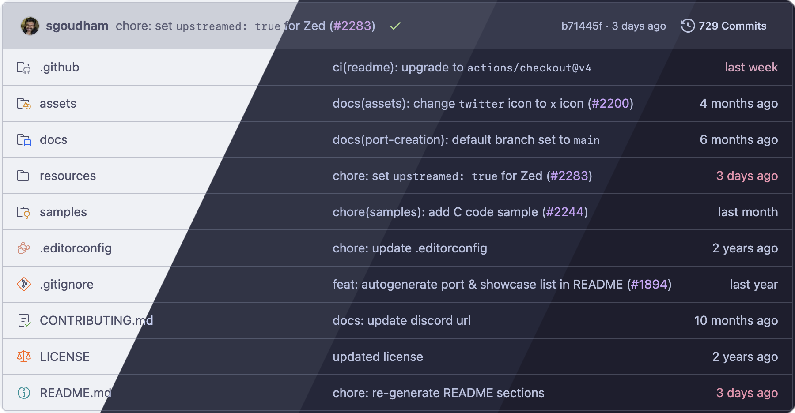
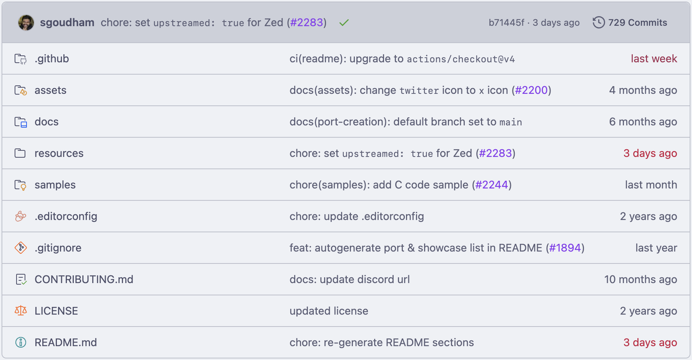
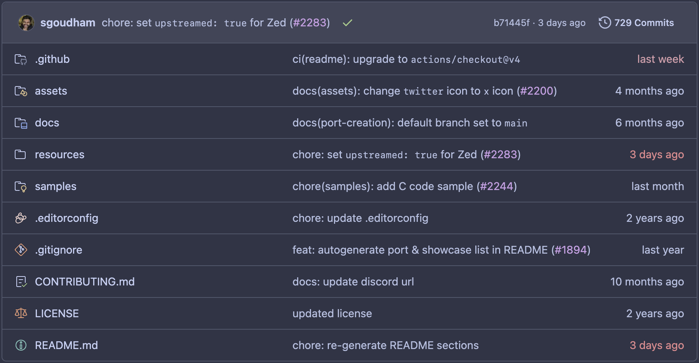
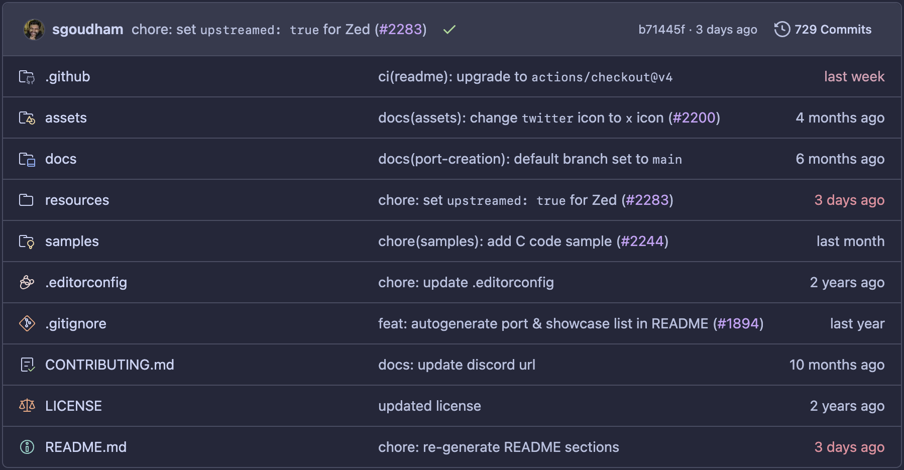
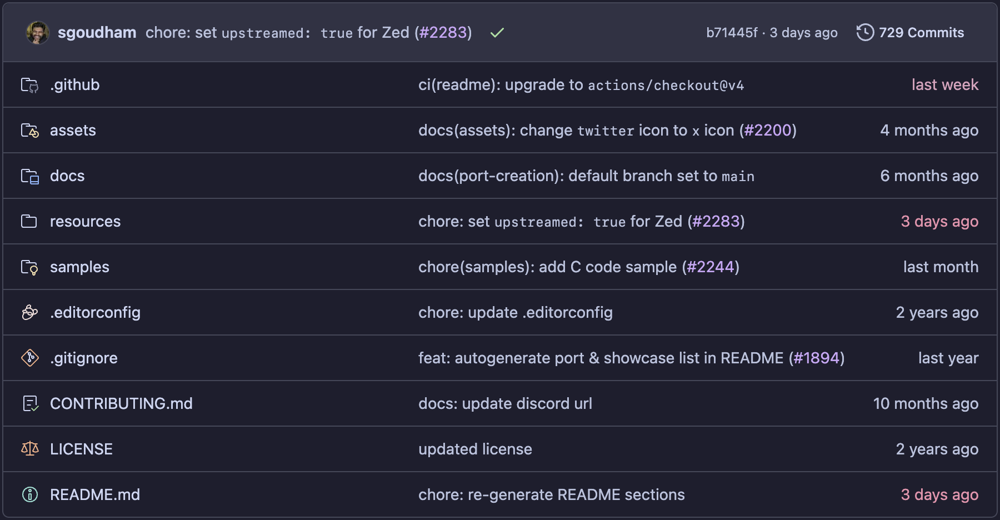

<h3 align="center">
	 
	
	Catppuccin for <a href="https://github.com">GitHub File Explorer Icons</a>
	
</h3>

	
	
	

  

	

## Previews

🌻 Latte

🪴 Frappé

🌺 Macchiato

🌿 Mocha

## Usage

### Marketplace

The extension is available on the Chrome Web Store, Firefox Add-ons, and Microsoft Edge Add-ons extension stores. Click on your browser's badge below to install.

  
  
  

### Manual

See the assets section at the bottom of [the latest release](https://github.com/catppuccin/github-file-explorer-icons/releases/latest) for pre-compiled zips of the extension. The Chrome zip will work for any Chromium browser (Microsoft Edge, Opera, Arc, etc.).

Chrome

1. Unzip the `catppuccin-github-icons-extension-<version>-chrome.zip` asset from the latest release.
2. Open the Extensions page by navigating to `chrome://extensions`.
3. Enable Developer Mode (if not already enabled) by flipping the toggle switch labeled **Developer mode**.
4. Click the **Load unpacked** button and select the unzipped directory from Step 1.

Firefox

1. Open the Add-ons page by navigating to `about:addons`.
2. Click the cog/settings icon in line with the "Manage Your Extensions" heading, and select **Debug Add-ons**.
3. Click the **Load Temporary Add-on...** button and select the `catppuccin-github-icons-extension-<version>-firefox.zip` asset from the latest release.

## Customization

This extension aims to provide the same configuration options as [catppuccin/vscode-icons](https://github.com/catppuccin/vscode-icons) does. The flavor of icons, custom associations, as well as the `monochrome` & `specificFolders` options, can be customized in the extension's popup window (click the extension icon in your browser toolbar to reveal the popup).

## 🙋 FAQ

- Q: **_"How can I enable this extension on a custom domain?"_**\
  A: See [fregante.github.io/webext-permission-toggle](https://fregante.github.io/webext-permission-toggle/?name=Catppuccin+for+GitHub+File+Explorer+Icons&icon=https://raw.githubusercontent.com/catppuccin/github-file-explorer-icons/main/src/public/icon-128.png).

## Contributing

See [the contributing guide](./CONTRIBUTING.md).

## 💝 Thanks to

- [uncenter](https://github.com/uncenter)
- [Claudiohbsantos/github-material-icons-extension](https://github.com/Claudiohbsantos/github-material-icons-extension)

&nbsp;

	

	Copyright &copy; 2021-present <a href="https://github.com/catppuccin" target="_blank">Catppuccin Org</a>

	

