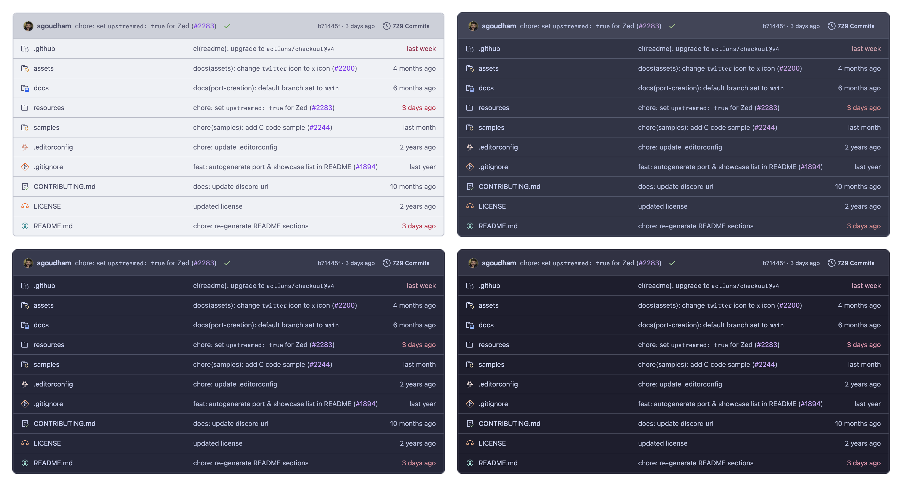

<h3 align="center">
	<br/>
	
	Catppuccin for <a href="https://github.com">GitHub File Explorer Icons</a>
	
</h3>

<p align="center">
	<a href="https://github.com/catppuccin/github-file-explorer-icons/stargazers"></a>
	<a href="https://github.com/catppuccin/github-file-explorer-icons/issues"></a>
	<a href="https://github.com/catppuccin/github-file-explorer-icons/contributors"></a>
</p>

<p align="center">
	
</p>

## Previews

<details>
<summary>🌻 Latte</summary>

</details>
<details>
<summary>🪴 Frappé</summary>

</details>
<details>
<summary>🌺 Macchiato</summary>

</details>
<details>
<summary>🌿 Mocha</summary>

</details>

## Usage

```bash
git clone https://github.com/catppuccin/github-file-explorer-icons.git && cd github-file-explorer-icons
pnpm install
```

### Chrome

1. Run `pnpm build` to build the extension (defaults to Chrome)
2. Open the Extensions page by navigating to `chrome://extensions`.
3. Enable Developer Mode by flipping the toggle switch labeled **Developer mode**.
4. Click the **Load unpacked** button and select the `dist/chrome-mv3` directory from the cloned repository.

### Firefox

1. Run `pnpm zip:firefox` to build and zip the extension for Firefox.
2. Open the Add-ons page by navigating to `about:addons`.
3. Click the cog/settings icon in line with the "Manage Your Extensions" heading, and select **Debug Add-ons**.
4. Click the **Load Temporary Add-on...** button and select the `dist/catppuccin-github-file-explorer-icons-<version>-firefox.zip` file from the cloned repository.

## 💝 Thanks to

- [uncenter](https://github.com/uncenter)
- [Claudiohbsantos/github-material-icons-extension](https://github.com/Claudiohbsantos/github-material-icons-extension)

&nbsp;

<p align="center">
	
</p>

<p align="center">
	Copyright &copy; 2021-present <a href="https://github.com/catppuccin" target="_blank">Catppuccin Org</a>
</p>

<p align="center">
	<a href="https://github.com/catppuccin/catppuccin/blob/main/LICENSE"></a>
</p>
